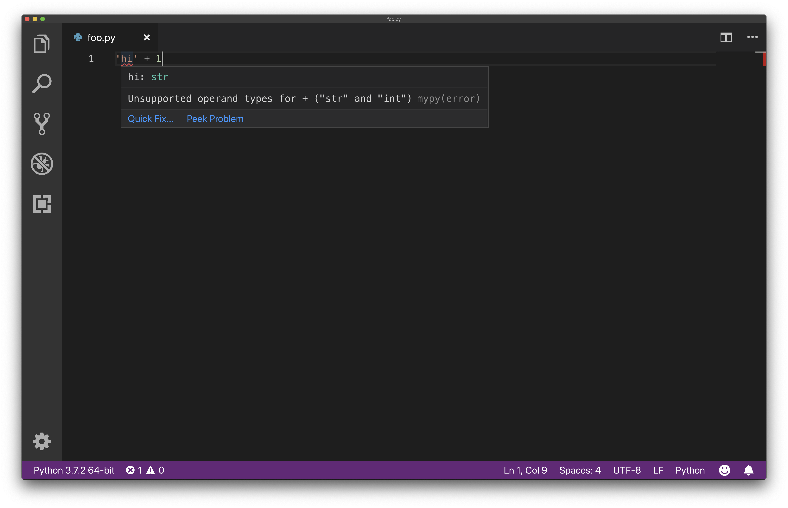
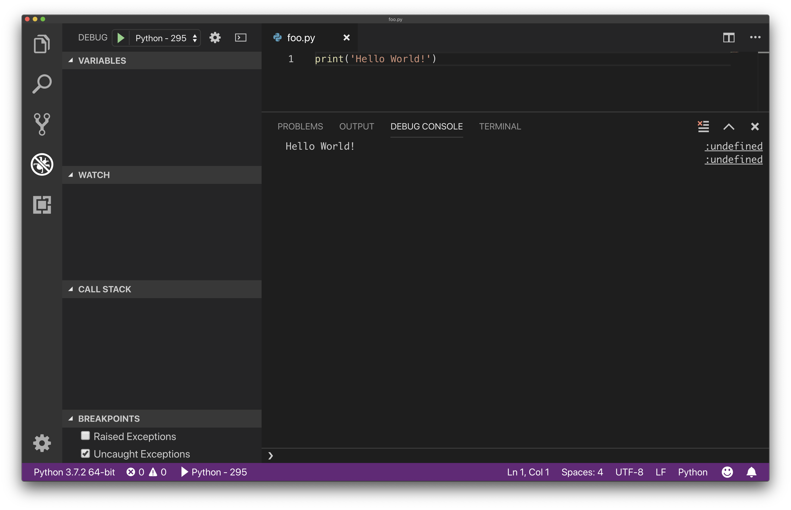

# Assignment 0: Hello World

## Introduction

This exercise will guide you in setting up your working environment for the quarter. By the end you'll be able to write a simple program that outputs "Hello World!" to the screen and will be ready for future assignments. We'll start by using Git to clone this repository, installing Python 🐍 (our programming language for this course) and Visual Studio Code (our text editor for this course), and finally writing our first Python program.

This guide is pretty long with a lot of instructions. I sincerely apologize for that but please make sure everything works for you at all stages along the way so that you don't have to worry about your environment for the rest of the course. And if you have any issues feel free to ask a peer mentor! Okay with that disclaimer let's get started!

### Overview of Tools

#### Python

Python <sup id="a1">[1](#f1)</sup> has several versions, for this course we're using `Python 3.7`. <sup id="a2">[2](#f2)</sup> This is the most up to date (stable) version. There are many people still using an older variant (`2.7`) but this has been sunsetted and will no longer be supported after 2020. In the interests of learning what will be the future of the language we're teaching `3.7`. If you've used `2.7` before the learning curve for `3.7` will be gentle as there aren't too many changes you'll have to worry about.

Visit [python.org](https://www.python.org) for more.

#### Git

Git is a version control tool that makes tracking changes to your work and collaborating with others easier! In this class we will also use it to submit assignments to GitHub (Git and GitHub are not the same thing, we'll discuss the distinction in lecture). Git comes preinstalled on macOS and Linux distributions, Windows users will have to install it which we'll cover below.

For now that's honestly all you need to know 😃 We'll discuss Git in more depth in lecture and peer mentors are always happy to answer any questions you may have in the future.

*Completely Optional:* If you're interested in learning more about it right now (or later) here are a few guides/resources you can read through. You won't need to know everything in these guides for this course and definitely don't worry if things don't make sense, that's why we'll talk about them in lecture!

- [An introduction to Git: what it is, and how to use it](https://medium.freecodecamp.org/what-is-git-and-how-to-use-it-c341b049ae61)
- [Learn enough Git to be dangerous](https://www.learnenough.com/git-tutorial/getting_started)

#### Visual Studio Code (VSCode)

A cross-platform text editor made by Microsoft with Python support including debugging. See [code.visualstudio.com](https://code.visualstudio.com) for more.

## Setup

### Automated

We've provided installation scripts for macOS and Windows (see them in the [`setup`](./setup) folder. The macOS script should theoretically also work on Linux and the Windows Subsystem for Linux (WSL) but we make no guarantees.

Both scripts install the newest version of [Python](https://www.python.org/) and [Visual Studio Code](https://code.visualstudio.com) (Linux and WSL users must install VSCode manually). The macOS script uses the [Homebrew](https://brew.sh) ([Linuxbrew](https://docs.brew.sh/Homebrew-on-Linux) on Linux & WSL) package manager while the Windows script uses the [Chocolatey](https://chocolatey.org/) package manager.

See the [manual installation guide](./manual_installation.md) for a more detailed explanation of the various pieces these scripts install.

To use the scripts follow the instructions for your OS below, using the manual instructions linked above if anything fails.

If at the end you get an "Installation successful" message then move onto [Using What We Installed](#using-what-we-installed).

#### macOS (& Linux & WSL, with caveats)

>Linux & WSL Caveat: Linuxbrew cannot install VSCode so you must install it either through your own package manager or through the [appropriate installer](https://code.visualstudio.com/download).

Open terminal (searching 'terminal' in Spotlight is probably the fastest way), copy and paste the following lines, then hit Enter. These lines run [this script](./setup/mac_os).

>Note: I promise our script is safe and completely reversible, but it is **always** a good idea to take a look at a script before running it.

```shell
install_script_url='https://raw.githubusercontent.com/nu-eecs-295/0/master/setup/mac_os'
sh -c "$(curl -fsSL "$install_script_url")"
```

#### Windows

>

Open admin powershell, easiest way to do so is right-click on Start menu and select the "Windows PowerShell (Admin)" option (see the photo on the right).

Once you have a session open, copy and paste the following lines, then hit Enter. These lines run [this script](./setup/windows.ps1).

>Note: I promise our script is safe and completely reversible, but it is **always** a good idea to take a look at a script before running it.

```powershell
Set-ExecutionPolicy Bypass -Scope Process -Force
$script_url='https://raw.githubusercontent.com/nu-eecs-295/0/master/setup/windows.ps1'
iex ((New-Object System.Net.WebClient).DownloadString("$script_url"))
```

<br /><br /><br /><br /><br /><br />

### Manual

> If either of the scripts mentioned above worked for you then ignore this section and skip ahead to the [Using What We Installed](#using-what-we-installed) section.

See the guide [here](./manual_installation.md).

## Using What We Installed

### Git

First things first let's clone this repository (or repo for short) to our computer. A repository is just a name for a collection of files tracked through Git. Cloning this repository will create a local copy of the files on our computer.

Open up your terminal (Powershell on Windows, Terminal on macOS/Linux), navigate to your Downloads folder using `cd` and `ls`, and run `git clone <repo-url>`, substituting in your repo's URL for `<repo-url>`. E.g. (note the required `.git` at the end):

>**Note:** if you haven't navigated the command line before Sara will cover this during lecture. For more help see [this guide](http://www.macworld.com/article/2042378/master-the-command-line-navigating-files-and-folders.html) (or come to peer mentor office hours).

```
git clone https://github.com/cs-nu/hello-world-nathanshelly.git
```

You can get the URL by appending `.git` to the address in your browser or click the green "Clone or download" button on the GitHub interface and copy the URL, see the photo below:


Once it has downloaded, `cd` into the cloned repository and run `ls` . It should look something like this (ask a peer mentor for help if you have any trouble):


## Writing Python

In this class we'll be writing Python code in VSCode and running our programs from either VSCode or a terminal.

Open up VSCode (however you normally open an application) and let's finally write some code, starting with an example of the linter we added in the setup process.

### Linter Interlude

A linter is a tool that helps us catch simplete errors that can be automatically detected. Here's an example.

Create a new file with the following line:

```python
'hi' + 1
```

Save the file as `<filename>.py` (`.py` is the extension for Python files) and you should notice some weird red squiggles under the `'hi'`, they might take a sec to pop up (if you don't see these try restarting VSCode). Hover over the squiggles to see the message screenshotted below:



This message is telling us we can't add a `str` (Python's shorthand for `string`) and an `int` (an integer). This sort of type checking will come in super helpful as we continue to write programs later in this class.

---

Alright now that we're acquainted with our linter let's write our first valid Python program.

Create a different file, save it (`File->Save` or `C-s` <sup id="a3">[3](#f3)</sup>) as `<net_id>.py` (make sure you type your NetID correctly for grading purposers) and in the repository we just cloned (by default this would be a folder called `hello-world-<github-username>` in Downloads).

Add `print('Hello World!')` to this new file, like below:


We've written a valid Python program, now let's run it!

## Running Python

### In VSCode

Go to `View->Debug` (keyboard shortcut `C-Shift-d`, or click on the icon with the crossed out bug in the left sidebar). In the resulting view click the dropdown next to the green play button in the top left and from the menu select `Python - 295` (the name of the launch configuration we just added in settings). Now click the green play button and you should see something like this:

>**Note:** if you see a dropdown with with multiple options such as `Python Experimental` choose the option that says `Python - 295`



You can see the output of our program `Hello World` in the Debug Console at the bottom of the screen. Don't worry about what everything in this view means, we'll get to it all over the first couple weeks of class.

## Submission

Assuming you saw 'Hello World' output successfully you're ready to turn in this assignment. To do so navigate to your local cloned repo (`hello-world-<github-username>` in your Downloads folder) and run the following commands (this will ask for your GitHub credentials):

```shell
git add .
git commit -m "Hello world!"
git push
```

You should see output like this:


Whew, you're officially done with the first assignment! <sup id="a4">[4](#f4)</sup> The rest of this guide is optional if you're interested in playing around more with python or VSCode. Feel free to do as much or little of it as you'd like.

### Just For Fun

#### Command Line: Integrated Terminal

So we just ran Python using the VSCode debugger now let's try running it through the command line! VSCode actually has an integrated command line that we can open by going to `View->Terminal` (or `Alt-x` (`Option-x`) on macOS and ``C-` `` on Windows).

For running Python files from the command line we need to be in the same folder as the file we want to run.

Once we're in the same folder as our Python file type `python <filename>`. Do this with the file you've just written, so if you named the file `foo.py` you'd write `python foo.py` and you should see 'Hello World!' outputted to the screen like below (note that you need to write the full filename with the `.py` extension):


#### Command Line Part II: This Time It's External

We've now run python code from the integrated terminal but we can also run code from an external terminal like we did to confirm installation. Open up your terminal (Powershell for Windows) like we did before, navigate to the folder the same way as in the integrated terminal and once again type `python <filename>` to see 'Hello World!' like below:


### VSCode Tips

Here's a few tips and things to explore in VSCode:

1. Go to `View->Explorer` (or click on the top icon in the left sidebar that looks like overlapping documents) to see a list of the current open files and a button to open a folder. Click on that button and choose a random folder on your computer to see that folder and its contents and be able to navigate it and open files from it within VSCode. This has the added benefit that the integrated terminal will automatically open to the opened folder you opened. The below screenshot shows my VSCode with a folder called `grading` open. I can then see and open any of the subfolders and files in this folder more easily (`C-p` opens a file searcher that searches through the open folder). 
2. Go to `(Code|File)->Preferences->Color Theme` if you'd like to adjust the colors of the editor. More themes can be found [here](https://marketplace.visualstudio.com/search?target=VSCode&category=Themes&sortBy=Downloads).
3. Go to `(Code|File)->Preferences->File Icon Theme` if you'd like icons in tabs or next to files/folders in the Explorer view. More icon themes can be found [here](https://marketplace.visualstudio.com/search?target=VSCode&category=Themes&sortBy=Downloads).
4. Go to `(Code|File)->Preferences->Keyboard Shortucts` to personalize keybindings.

---

<!-- footnotes - https://stackoverflow.com/a/32119820 -->

<b id="f1">1:</b> Python is a widely used programming language older than us. Click [here](https://docs.python.org/3/) to view the official documentation. [↩](#a1)

<b id="f2">2:</b> Python versions have three numbers, for example Python `3.7.1` but for this course any Python version that starts with `3.7` will work just fine! [↩](#a2)

<b id="f3">3:</b> `C-<key>` is short for the keyboard shortcut `Cmd+<key>` on macOS, `Ctrl+<key>` on Windows. [↩](#a3)

<b id="f4">4:</b> [Hip hip hooray!](https://media.giphy.com/media/26gsfdArwyEnXnDGw/giphy.gif) [↩](#a4)
