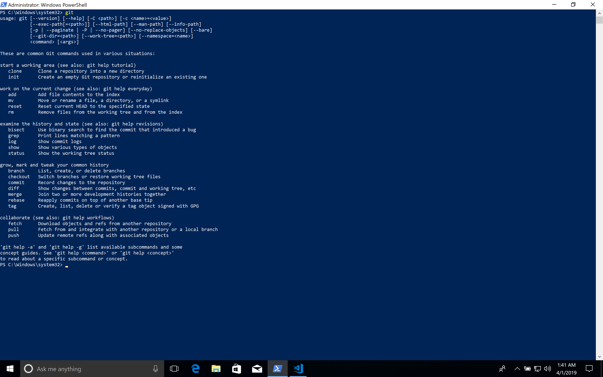
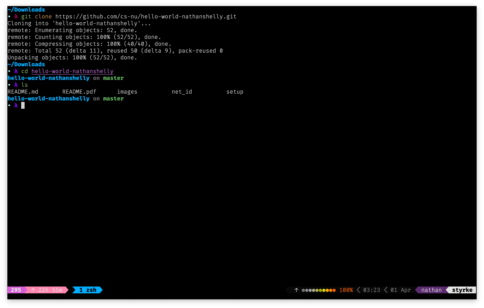
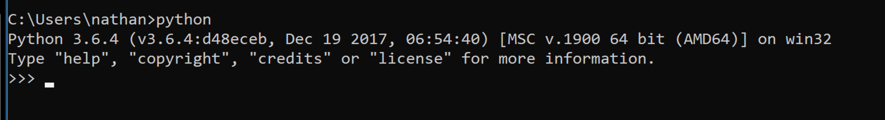
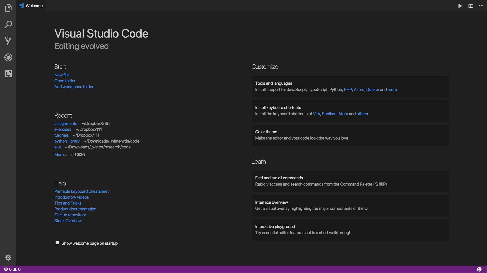
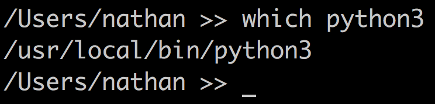
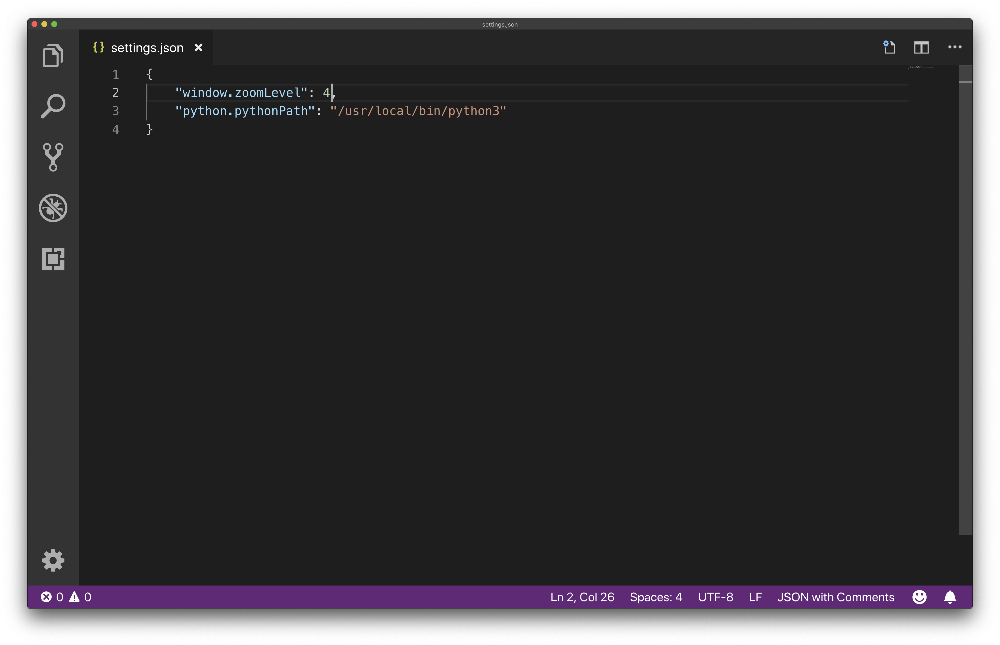
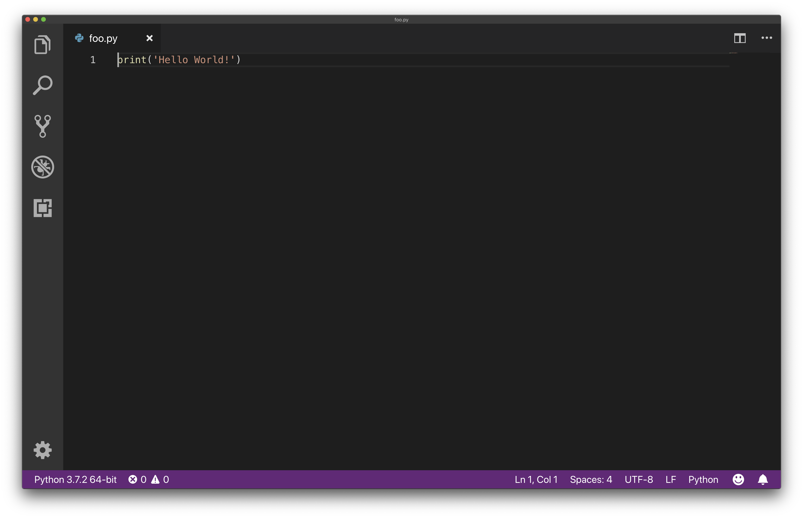
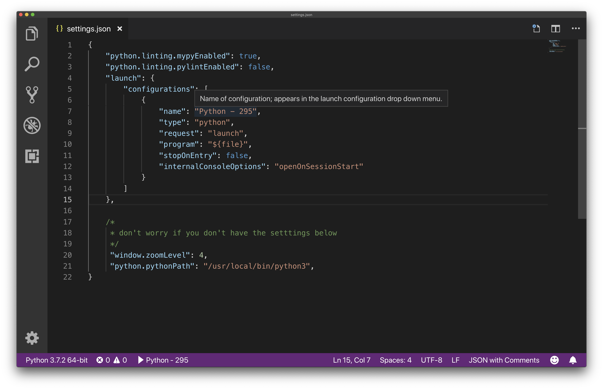

# Assignment 0: Hello World

## Introduction

This exercise will guide you in setting up your working environment for the quarter. By the end you'll be able to write a simple program that outputs "Hello World!" to the screen and will be ready for future assignments. We'll start by using Git to clone this repository, installing Python 🐍 (our programming language for this course) and Visual Studio Code (our text editor for this course), and finally writing our first Python program.

This guide is pretty long with a lot of instructions. I sincerely apologize for that but please make sure everything works for you at all stages along the way so that you don't have to worry about your environment for the rest of the course. And if you have any issues feel free to ask a peer mentor! Okay with that disclaimer let's get started!

## Git

### Overview

Git is a version control tool that makes tracking changes to your work and collaborating with others easier! In this class we will also use it to submit assignments to GitHub (Git and GitHub are not the same thing, we'll discuss the distinction in lecture). Git comes preinstalled on macOS and Linux distributions, Windows users will have to install it which we'll cover below.

For now that's honestly all you need to know 😃 We'll discuss Git in more depth in lecture and peer mentors are always happy to answer any questions you may have in the future. For macOS and Linux users skip ahead to [Quick Usage](#quick-usage), Windows users continue on to [Installation (Windows only)](#installation-windows-only).

*Completely Optional:* If you're interested in learning more about it right now here are a few guides/resources you can read through. You won't need to know everything in these guides for this course and definitely don't worry if things don't make sense, that's why we'll talk about them in lecture!

- [An introduction to Git: what it is, and how to use it](https://medium.freecodecamp.org/what-is-git-and-how-to-use-it-c341b049ae61)
- [Learn enough Git to be dangerous](https://www.learnenough.com/git-tutorial/getting_started)

### Installation (Windows only)

The easiest way to install on Windows is to use the [Git installer](https://git-scm.com/download/win) (download should start automatically). Once it finishes downloading run the installer (simply clicking next on each screen and accepting the defaults will work just fine). To test that installation succeeded open up a command prompt by clicking on the Windows button (or hitting the Windows key) then typing "command prompt" and selecting the search result labeled "Command Prompt". In the window that opens type `git` and hit Enter, you should see something like this:



If you don't see outtput like the above photo try restarting your command prompt and running again, then ask a peer mentor for help if that still doesn't work.

### Quick Usage

First things first let's clone this repository (or repo for short) to our computer. A repository is just a name for a collection of files tracked through Git. Cloning this repository will create a local copy of the files on our computer.

Open up your terminal (Command Prompt on Windows, Terminal on macOS/Linux) and run `git clone <repo-url>`, substituting in your repo's URL for `<repo-url>`. Here's what mine looks like: `git clone https://github.com/cs-nu/assert-295-pure-fun-nathanshelly.git` (note the required `.git` at the end).

<!-- TODO: update photos here -->

You can get the URL by appending `.git` to the address in your browser or click the green "Clone or download" button on the GitHub interface and copy the URL, see the photo below:


Once it has downloaded, `cd` into the cloned repository and run `ls` (on macOS and Linux) or `dir` (on Windows). It should look something like this (ask a peer mentor for help if you have any trouble):



>**Note:** we just used `cd` and `ls` (or `dir`) to navigate the command line. Don't worry if you didn't know what those commands meant as you typed them. We'll talk more about this in the [Command Line: Integrated Terminal](#command-line-integrated-terminal) section later and in lecture.

## Automated Installation

We've provided installation scripts for macOS and Windows in the `setup` folder. The macOS script should theoretically also work on Linux and the Windows Subsystem for Linux (WSL) but we make no guarantees.

Both scripts install the newest version of [Python](https://www.python.org/) and [Visual Studio Code](https://code.visualstudio.com) (Linux and WSL users must install VSCode manually). The macOS script uses the [Homebrew](https://brew.sh) package manager while the Windows script uses the [Chocolatey](https://chocolatey.org/) package manager.

See the [Manual Installation](#manual-installation) section for a more detailed explanation of the various pieces these scripts install.

### Windows

Open up Command Prompt as an administrator by clicking on the Windows button, typing "command prompt", and right clicking the search result labeled "Command Prompt" then choose "Run as administrator" in the resulting menu (see an example photo [next to the Windows bullet point](#python) in the Manual Installation section below).

Once you have a shell open, `cd` to the `setup` directory in this repo holding the script and run `CMD /k windows.exe`.

### macOS (& Linux & WSL)

Open up Terminal, `cd` to the `setup` directory in this repo holding the script and run `./mac_os`.

## Manual Installation

If either of the scripts mentioned above worked for you then ignore this section and skip ahead to the [Confirm Installation](#confirm-installation) section.

### Python

First let's install Python! <sup id="a1">[1](#f1)</sup> Python has several versions, for this course we're using `Python 3.7`. <sup id="a2">[2](#f2)</sup> This is the most up to date version. There are many people still using an older variant (`2.7`) but this has been sunsetted and will no longer be supported after 2020. In the interests of learning what will be the future of the language we're teaching `3.7`. If you've used `2.7` before the learning curve for `3.7` will be gentle as there aren't too many changes you'll have to worry about. To install follow the below instructions depending on your OS. <sup id="a3">[3](#f3)</sup>

>**Note:** If you feel comfortable using a virtual environment manager like `Conda` feel free to use that for this course instead of the following instructions (if you don't know what this means then keep reading for the standard install instructions).

- **macOS:** `Python 2.7` comes preinstalled on macOS. Unfortunately, since we want `3.7` we're going to have to install it separately. Our suggested method involves using a package manager called Homebrew. If you have any questions about this method or would like to install in a different way feel free to ask peer mentors about it at office hours. To use our recommended method follow [this guide](http://docs.python-guide.org/en/latest/starting/install3/osx/). Do everything up until (not including) the section titled "Pipenv & Virtual Environments".
- **Windows:** Our suggested method involves a package manager called Chocolatey. If you have any questions about this method or would like to install in a different way feel free to ask peer mentors about it at office hours. To use our recommended method follw [this guide](http://docs.python-guide.org/en/latest/starting/install3/win/). Do everything up until (not including) the section titled "Pipenv & Virtual Environments".

>
>
>**Note:** For installing Chocolatey I recommend using Command Prompt over Powershell since it involves one less step. Simply click on the Windows button, type "command prompt" and right click on the search result labeled Command Prompt then choose "Run as administrator" in the resulting menu. See the photo to the right for an example.

- **Linux:** There are too many Linux variants to attempt to cover them all but general advice is use a package manager and go to office hours with any questions or difficulties installing.

<br /><br /><br /><br /><br /><br />

### Visual Studio Code

Next we're going to install the text editor we're using for this course. There are many different text editors out there that you're welcome to explore but for this course we're going to be using Visual Studio Code.

Go to [this page](https://code.visualstudio.com/Download) and download the appropriate installer. Once the download finishes follow the prompts to install (simply clicking next on each screen and accepting the defaults will work just fine).

## Confirm Installation

### Python

To confirm everything is working right open up your shell (likely already open if you used one of the scripts) and type `python` then hit Enter. You should see something like the following (this is an example run on Windows though it should look similar on every platform, really the only change is it will list OS specific architecture in the right hand corner, in this case it's `win32`, on recent macOS models it's `darwin`):



If you see something similar and as long as your Python version says `3.7.<anything here>` you're all good! Go ahead and close your command line and move on to the next step. <sup id="a4">[4](#f4)</sup> If not, come to see Sara or a peer mentor for help.

>**Note:** If you see `2.7.<anything here>` instead, try typing `python3` then hitting enter and seeing if that gives you something like the image above with `3.7.<anything here>` for the version. If it does then feel free to ask a peer mentor how to make `python` launch `Python 3.7` by default but be aware that you can continue this guide swapping in `python3` anywhere you see `python` and `pip3` anywhere you see `pip`. If neither of these work try restarting your computer and running again, then go to a peer mentor for assistance if that doesn't change anything.

### Visual Studio Code

Open VSCode however you normally open up applications and you should see a screen like this:



VSCode has almost unlimited configuration and customization options along with numerous capabilities that we won't be using in this class. Feel free to explore these as you'd like but for this guide we'll focus on a small subset of features.

## Setting up Visual Studio Code

VSCode works well out of the box but there are still a few things we need to set up.

### Add Python Support

First things first let's add Python support. To do so we need to install an extension and set VSCode's Python path. Almost everything I'm about to walk through can be done with keyboard shortcuts (which I'll try to list) if you like using them but I'll be prioritizing menu items as these are more universal across OSes. Note: if you see an error "Unknown configuration setting" while working through this section first try restarting VSCode before asking Sara or a peer mentor for assistance.

#### Extension

First click on `View->Extensions` (macOS/Win: `(Cmd|Ctrl)+Shift+x` or click on the square icon at the bottom of the leftmost sidebar) and then type "Python" in the search box. We want to install the extension just titled "Python" which is made by Microsoft:


Click install and tada 🎉, we now have Python support!

#### Python Path

Open a new file by clicking `File->New File` (or `(Cmd|Ctrl)+n`). Next, set the language for this file to Python by clicking `View->Command Palette` (or `(Cmd|Ctrl)+Shift+p`) and type "language". From the list of results that pops up choose "Change Language Mode". Then type "Python" in the resulting search box and select Python from the list. Now look in the lower left hand corner (see below photo for an example) and confirm that it says `Python 3.7.<anything-else>`. If it does skip ahead to the [next section](#add-linting).

If you don't see anything try restarting VSCode.

If it shows `Python 2.<anything-else>` stick around and we'll fix it.

>**Note:** for Conda users you'll want to set this to the path to the `python` instance in the `bin` folder of your virtual environment.


To make it so that you get `Python 3.7.<anything-else>` we need to change a setting. VSCode allows editing settings through a graphical interface and a JSON file. We want to edit the JSON file. The easiest way to get to the JSON file to click `View->Command Palette` (or `(Cmd|Ctrl)+Shift+p`) and type `settings` then select the option "Preferences: Open Settings (JSON)". The photo below shows what selecting that option looks like. Feel free to ignore any settings that are already in the file.


We want to add the following code to this file:

```json
{
    "python.pythonPath": "<path_to_python_installation>"
}
```

You need to replace `<path_to_python_installation>` with the actual location of the Python 3 installation on your computer. On macOS for example this is the path: `/usr/local/bin/python3`.

>Note: on Windows this path would normally use backslashes but here you should use either forward slashes or double backslashes, e.g. `C:/Users/nathan/<rest of path>` or `C:\\Users\\nathan\\<rest of path>` (if you're curious why ask one of the peer mentors about escape characters).

The easiest way to find where Python 3 is installed on your computer is to run one of the following commands (depending on your OS) in terminal or command prompt:

```bash
which python # macOS/Linux
where python # Windows
```

Here's an example of the output (run on macOS, note I'm running `which python3` because I have multiple Python installations, you should not type the 3 unless back in the confirm installation section running `python` didn't show `3.7.<anything-else>`):



Now write the path that `which/where python` gives you in place of `"<path_to_python_installation>"` in the settings pane. At the end you should have something that looks like this (again don't worry about other settings in the same file):



Confirm that after restarting VSCode and selecting the language Python as before you now see `3.7.<anything>` in the lower left hand corner. If not go to mentor hours. Whew, okay let's move on to setting up the rest of our Python support!

### Add Linting

Linting is a form of statically checking programs to catch certain errors before running. The linter we install will help by checking types (Python 3's support for type hints is another reason we're using it over Python 2) and preventing silly mistakes.

Setting up this linter requires two steps. First, run the following command in the terminal (or Command Prompt):

```bash
pip install mypy
```

You should see something like this (run on macOS):


This command will install our linter (if you're curious `pip` is a package manager bundled with Python 3 for installing Python libraries that we'll discuss more later in the course). Next, we need to configure our linter.

VSCode allows editing settings through a graphical interface and a JSON file. We want to edit the JSON file. The easiest way to get to the JSON file to click `View->Command Palette` (or `(Cmd|Ctrl)+Shift+p`) and type `settings` then select the option "Preferences: Open Settings (JSON)". The photo below shows what selecting that option looks like. Feel free to ignore any settings that are already in the file.


We want to add the following lines:

```json
{
    "python.linting.mypyEnabled": true,
    "python.linting.pylintEnabled": false
}
```

>**Note:** the whole settings is a single JSON dictionary, so if you added the python path previously the settings below would be two more lines inside the outer curly brackets, not inside a nested pair of brackets (see the photo below)

After adding these our settings file will look something like this (potentially with an extra setting from modifying our path if you had to do that earlier):


Let's test this out. Open a new file and add the following:

```python
'hi' + 1
```

Save the file with the `.py` extension (e.g. `foo.py`) and you should notice some weird red squiggles under the `'hi'` (if you don't see these try restarting VSCode). Hover over this to see the message screenshotted below:


This message is telling us we can't add a `str` (Python's shorthand for `string`) and an `int` (an integer). This sort of type checking will come in super helpful as we continue to write programs later in this class. Okay now with everything set up let's write our first program and run it!

## Working in Python

In this class we'll be writing Python code in VSCode and running our programs from either VSCode or the Command Line. First let's write a simple program. Replace the code we just wrote with `print('Hello World!')`, like below:



Now save this file (`File->Save` or `(Cmd|Ctrl)+s`). We've written a Python program, now let's run it!

### VSCode

#### Setting Our Launch Configuration

First we need to set our launch configuration. Open up settings again (see the [Add Linting](#add-linting) section) and add the following code:

```json
"launch": {
    "configurations": [
        {
            "name": "Global Python",
            "type": "python",
            "request": "launch",
            "program": "${file}",
            "stopOnEntry": true,
            "internalConsoleOptions": "openOnSessionStart"
        }
    ]
}
```

Here is what my final settings looks like (promise we won't need to edit this again):



#### Running Code

Okay now let's run our code! Go to `View->Debug` (keyboard shortcut `(Cmd|Ctrl)+Shift+d`, or click on the icon with the crossed out bug in the left sidebar). In the resulting view click the dropdown next to the green play button in the top left and from the menu select `Python - 295` (the name of the launch configuration we just added in settings). Now click the green play button and you should see something like this:

>**Note:** if you see a dropdown with with multiple options such as `Python Experimental` choose the option that says `Python - 295`


You can see the output of our program `Hello World` in the Debug Console at the bottom of the screen. Don't worry about what everything in this view means, we'll get to it all over the first couple weeks of class.


## Submission

Whew, you're officially done with the first assignment! <sup id="a5">[5](#f5)</sup>  There isn't anything to turn in so as long as you've successfully completed everything in this guide you're all good! The rest of this guide is optional if you're interested in playing around more with python or VSCode. Feel free to do as much or little of it as you'd like.

### Just For Fun

#### Command Line: Integrated Terminal

So we just ran Python using the VSCode debugger now let's try running it through the command line! VSCode actually has an integrated command line that we can open by going to `View->Terminal` (or ``Ctrl+` ``).

>Note: for Windows users this will likely open to Powershell, change this by clicking `View->Command Palette` (or `(Cmd|Ctrl)+Shift+p`) then type "select default shell", choose the "Terminal: Select default shell" option and in the resulting menu select "Command Prompt".

For running Python files from the command line we need to be in the same folder as the file we want to run. To do so we need to be able to navigate the command line. Sara will cover this during the first lecture, for more help see the following guides (or come to peer mentor office hours):

- [Windows](http://www.digitalcitizen.life/command-prompt-how-use-basic-commands)
- [macOS and Linux](http://www.macworld.com/article/2042378/master-the-command-line-navigating-files-and-folders.html)

Once we're in the same folder as our Python file type `python <filename>`. Do this with the file you've just written, so if you named the file `foo.py` you'd write `python foo.py` and you should see 'Hello World!' outputted to the screen like below (note that you need to write the full filename with the `.py` extension):


#### Command Line Part II: This Time It's External

We've now run python code from the integrated terminal but we can also run code from an external terminal like we did to confirm installation. Open up your terminal (Command Prompt for Windows) like we did before, navigate to the folder the same way as in the integrated terminal and once again type `python <filename>` to see 'Hello World!' like below:


### VSCode Tips

Here's a few tips and things to explore in VSCode:

1. Go to `View->Explorer` (or click on the top icon in the left sidebar that looks like overlapping documents) to see a list of the current open files and a button to open a folder. Click on that button and choose a random folder on your computer to see that folder and its contents and be able to navigate it and open files from it within VSCode. This has the added benefit that the integrated terminal will automatically open to the opened folder you opened. The below screenshot shows my VSCode with a folder called `grading` open. I can then see and open any of the subfolders and files in this folder more easily (`(Cmd|Ctrl)+p` opens a file searcher that searches through the open folder). 
2. Go to `(Code|File)->Preferences->Color Theme` if you'd like to adjust the colors of the editor. More themes can be found [here](https://marketplace.visualstudio.com/search?target=VSCode&category=Themes&sortBy=Downloads).
3. Go to `(Code|File)->Preferences->File Icon Theme` if you'd like icons in tabs or next to files/folders in the Explorer view. More icon themes can be found [here](https://marketplace.visualstudio.com/search?target=VSCode&category=Themes&sortBy=Downloads).
4. Go to `(Code|File)->Preferences->Keyboard Shortucts` to personalize keybindings.

---

<!-- footnotes - https://stackoverflow.com/a/32119820 -->

<b id="f1">1:</b> Python is a widely used programming language older than us. Click [here](https://docs.python.org/3/) to view the official documentation. [↩](#a1)

<b id="f2">2:</b> Python versions have three numbers, for example Python `3.7.1` but for this course any Python version that starts with `3.7` will work just fine! [↩](#a2)

<b id="f3">3:</b> Linux users try the Confirm Installation step and if you get the expected result then you're all good and can keep going with this guide. If not go to Sara or one of the peer mentors for help. [↩](#a3)

<b id="f4">4:</b> What we just started by typing `python` and hitting enter is called the Python Interpreter. This is an interactive environment like the REPL we had in 111 where you can write Python code and immediately see the result. For an example type `5+5` and hit enter. The interpreter will display 10 and then wait for your next instruction. Feel free to play around in the shell further if you'd like. To exit the shell and get back to your regular command line type `exit` and hit enter for macOS, on Windows type `exit()` and hit enter. [↩](#a4)

<b id="f5">5:</b> [Hip hip hooray!](https://media.giphy.com/media/26gsfdArwyEnXnDGw/giphy.gif) [↩](#a5)
