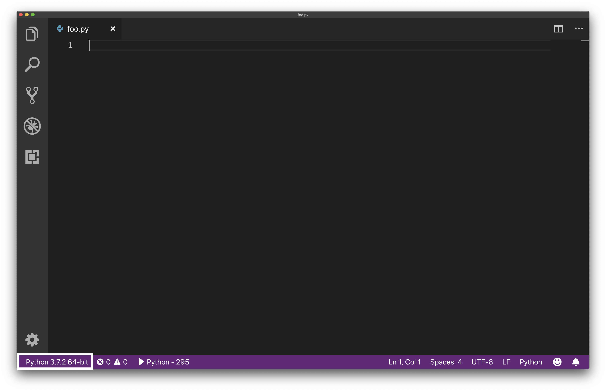
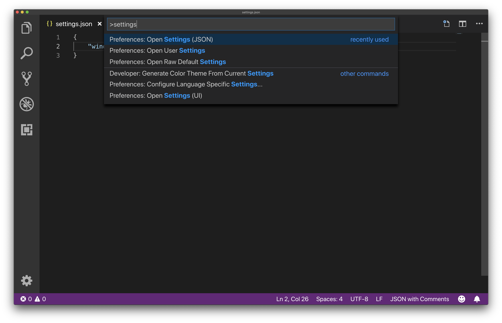

# Manual Installation

See the [README](./README.md) for overall assignment instructions.

## Git (Windows only)

The easiest way to install on Windows is to use the [Git installer](https://git-scm.com/download/win) (download should start automatically). Once it finishes downloading run the installer (simply clicking next on each screen and accepting the defaults will work just fine). To test that installation succeeded open up Powershell by clicking on the Windows button (or hitting the Windows key) then typing "powershell" and selecting the search result labeled "Windows PowerShell". In the window that opens type `git` and hit Enter, you should see something like this:


If you don't see output like the above photo try restarting Powershell and prompt and running again, then ask a peer mentor for help if that still doesn't work.

## Python

Follow the instructions for your OS below. <sup id="a1">[1](#f1)</sup>

>**Note:** If you feel comfortable using a virtual environment manager like `Conda` feel free to use that for this course instead of the following instructions (if you don't know what this means then keep reading for the standard install instructions).

### macOS

`Python 2.7` comes preinstalled on macOS. Unfortunately, since we want `3.7` we're going to have to install it separately. Our suggested method involves using a package manager called Homebrew. If you have any questions about this method or would like to install in a different way feel free to ask peer mentors about it at office hours. To use our recommended method follow [this guide](http://docs.python-guide.org/en/latest/starting/install3/osx/). Do everything up until (not including) the section titled "Pipenv & Virtual Environments".

### Windows

Our suggested method involves a package manager called Chocolatey. If you have any questions about this method or would like to install in a different way feel free to ask peer mentors about it at office hours. To use our recommended method follw [this guide](http://docs.python-guide.org/en/latest/starting/install3/win/). Do everything up until (not including) the section titled "Pipenv & Virtual Environments".

>
>
>**Note:** For installing Chocolatey use Admin Powershell. To do so right-click on the Start menu and select the "Windows PowerShell (Admin)" option. See the photo to the right for an example.

### Linux

There are too many Linux variants to attempt to cover them all but general advice is use a package manager and go to office hours with any questions or difficulties installing.

<br /><br /><br /><br /><br /><br /><br /><br />

## Visual Studio Code

Next we'll install our text editor (there are many different text editors out there that you're welcome to explore but for this course we're going to be using Visual Studio Code).

Download the appropriate installer for your OS [here](https://code.visualstudio.com/Download). Once the download finishes follow the prompts to install (simply clicking next on each screen and accepting the defaults will work just fine).

## Confirm Installation/Configuration

### Python

To confirm everything is working right open up your shell (likely already open if you used one of the scripts) and type `python` then hit Enter. You should see something like the following (this is an example run on Windows though it should look similar on every platform, really the only change is it will list OS specific architecture in the right hand corner, in this case it's `win32`, on recent macOS models it's `darwin`):


If you see something similar and as long as your Python version says `3.7.<anything here>` you're all good! Go ahead and close your command line and move on to the next step. <sup id="a2">[2](#f2)</sup> If not, come to see Sara or a peer mentor for help.

>**Note:** If you see `2.7.<anything here>` instead, try typing `python3` then hitting enter and seeing if that gives you something like the image above with `3.7.<anything here>` for the version. If it does then feel free to ask a peer mentor how to make `python` launch `Python 3.7` by default but be aware that you can continue this guide swapping in `python3` anywhere you see `python` and `pip3` anywhere you see `pip`. If neither of these work try restarting your computer and running again, then go to a peer mentor for assistance if that doesn't change anything.

### Visual Studio Code

Open VSCode however you normally open up applications and you should see a screen like this:


VSCode has almost unlimited configuration and customization options along with numerous capabilities that we won't be using in this class. Feel free to explore these as you'd like but for this guide we'll focus on a small subset of features.

## Setting up Visual Studio Code

VSCode works well out of the box but there are still a few things we need to set up.

### Add Python Support

First things first let's add Python support. To do so we need to install an extension and set VSCode's Python path. Almost everything I'm about to walk through can be done with keyboard shortcuts (which I'll try to list) if you like using them but I'll be prioritizing menu items as these are more universal across OSes. Note: if you see an error "Unknown configuration setting" while working through this section first try restarting VSCode before asking Sara or a peer mentor for assistance.

#### Extension

First click on `View->Extensions` (macOS/Win: `C-Shift-x` <sup id="a3">[3](#f3)</sup> or click on the square icon at the bottom of the leftmost sidebar) and then type "Python" in the search box. We want to install the extension just titled "Python" which is made by Microsoft:


Click install and tada 🎉, we now have Python support!

#### Python Path

Open a new file by clicking `File->New File` (or `C-n`). Next, set the language for this file to Python by clicking `View->Command Palette` (or `C-Shift-p`) and type "language". From the list of results that pops up choose "Change Language Mode". Then type "Python" in the resulting search box and select Python from the list. Now look in the lower left hand corner (see below photo for an example) and confirm that it says `Python 3.7.<anything-else>`. If it does skip ahead to the [next section](#add-linting).

If you don't see anything try restarting VSCode.

If it shows `Python 2.<anything-else>` stick around and we'll fix it.

>**Note:** for Conda users you'll want to set this to the path to the `python` instance in the `bin` folder of your virtual environment.



To make it so that you get `Python 3.7.<anything-else>` we need to change a setting. VSCode allows editing settings through a graphical interface and a JSON file. We want to edit the JSON file. The easiest way to get to the JSON file to click `View->Command Palette` (or `C-Shift-p`) and type `settings` then select the option "Preferences: Open Settings (JSON)". The photo below shows what selecting that option looks like. Feel free to ignore any settings that are already in the file.



We want to add the following code to this file:

```json
{
    "python.pythonPath": "<path_to_python_installation>"
}
```

You need to replace `<path_to_python_installation>` with the actual location of the Python 3 installation on your computer. On macOS for example this is the path: `/usr/local/bin/python3`.

>Note: on Windows this path would normally use backslashes but here you should use either forward slashes or double backslashes, e.g. `C:/Users/nathan/<rest of path>` or `C:\\Users\\nathan\\<rest of path>` (if you're curious why ask one of the peer mentors about escape characters).

The easiest way to find where Python 3 is installed on your computer is to run one of the following commands (depending on your OS) in terminal or Powershell:

```bash
which python # macOS/Linux
where python # Windows
```

Here's an example of the output (run on macOS, note I'm running `which python3` because I have multiple Python installations, you should not type the 3 unless back in the confirm installation section running `python` didn't show `3.7.<anything-else>`):


Now write the path that `which/where python` gives you in place of `"<path_to_python_installation>"` in the settings pane. At the end you should have something that looks like this (again don't worry about other settings in the same file):


Confirm that after restarting VSCode and selecting the language Python as before you now see `3.7.<anything>` in the lower left hand corner. If not go to mentor hours. Whew, okay let's move on to setting up the rest of our Python support!

### Add Linting

Linting is a form of statically checking programs to catch certain errors before running. The linter we install will help by checking types (Python 3's support for type hints is another reason we're using it over Python 2) and preventing silly mistakes.

Setting up this linter requires two steps. First, run the following command in the terminal (or Powershell):

```bash
pip install mypy
```

You should see something like this (run on macOS):


This command will install our linter (if you're curious `pip` is a package manager bundled with Python 3 for installing Python libraries that we'll discuss more later in the course). Next, we need to configure our linter.

VSCode allows editing settings through a graphical interface and a JSON file. We want to edit the JSON file. The easiest way to get to the JSON file to click `View->Command Palette` (or `C-Shift-p`) and type `settings` then select the option "Preferences: Open Settings (JSON)". The photo below shows what selecting that option looks like. Feel free to ignore any settings that are already in the file.


We want to add the following lines:

```json
{
    "python.linting.mypyEnabled": true,
    "python.linting.pylintEnabled": false
}
```

>**Note:** the whole settings is a single JSON dictionary, so if you added the python path previously the settings below would be two more lines inside the outer curly brackets, not inside a nested pair of brackets (see the photo below)

After adding these our settings file will look something like this (potentially with an extra setting from modifying our path if you had to do that earlier):


### Setting Our Launch Configuration

This launch configuration determines how the VSCode debugger will run our code.

Open up settings again (see the [Add Linting](#add-linting) section) and add the following code:

```json
"launch": {
    "configurations": [
        {
            "name": "Global Python",
            "type": "python",
            "request": "launch",
            "program": "${file}",
            "internalConsoleOptions": "openOnSessionStart"
        }
    ]
}
```

Here is what my final settings looks like (promise we won't need to edit this again):


# All Done

With that you're officially done with installation/configuration. Go back to the original instructions starting from the [Using What We Installed](./README.md#using-what-we-installed) section.

---

<!-- footnotes - https://stackoverflow.com/a/32119820 -->

<b id="f1">1:</b> Linux users try the Confirm Installation step and if you get the expected result then you're all good and can keep going with this guide. If not go to Sara or one of the peer mentors for help. [↩](#a1)

<b id="f2">2:</b> What we just started by typing `python` and hitting enter is called the Python Interpreter. This is an interactive environment like the REPL we had in 111 where you can write Python code and immediately see the result. For an example type `5+5` and hit enter. The interpreter will display 10 and then wait for your next instruction. Feel free to play around in the shell further if you'd like. To exit the shell and get back to your regular command line type `exit` and hit enter for macOS, on Windows type `exit()` and hit enter. [↩](#a2)

<b id="f3">3:</b> `C-<key>` is short for the keyboard shortcut `Cmd+<key>` on macOS, `Ctrl+<key>` on Windows. [↩](#a3)
